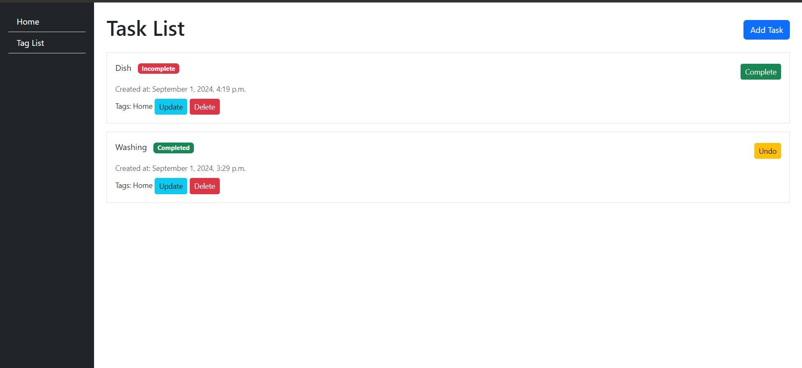
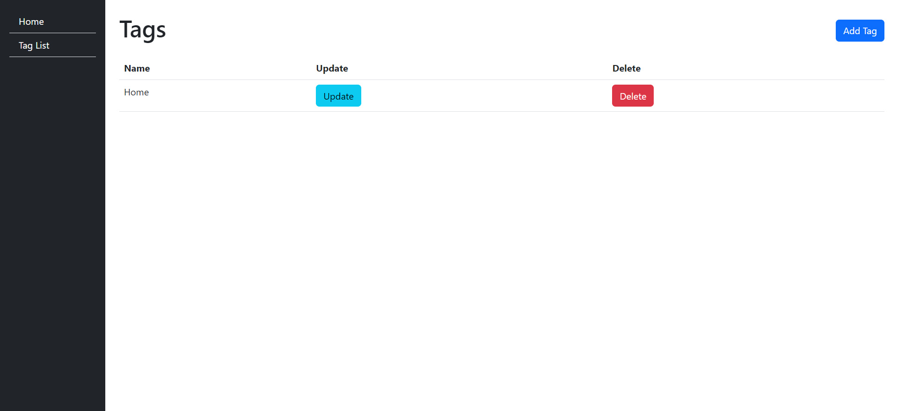

# Django Task Management App

This is a simple task management application built with Django, allowing users to create and manage tasks with optional deadlines and tags. The app includes a sidebar for easy navigation between the home page and the tag list page.

## Features

### Models

1. **Task**: Represents an individual task in the to-do list. The task has the following attributes:
   - `content`: A text field describing what needs to be done.
   - `created_at`: A date and time field recording when the task was created.
   - `deadline`: An optional date and time field for setting a deadline for the task.
   - `is_done`: A boolean field indicating whether the task is completed.
   - `tags`: A many-to-many relationship with the `Tag` model for categorizing tasks.

2. **Tag**: Represents a tag that can be associated with tasks. The model has one attribute:
   - `name`: A unique name for the tag.

### Pages

1. **Home Page** (`/`):
   - **Sidebar**: Contains links to the Home page and the Tag list page. The sidebar is present on all pages.
   - **Task List**: Displays a list of tasks, ordered by completion status (incomplete tasks first) and by creation date (newest first).
   - **Task Information**: Each task displays its content, creation date, deadline (if any), completion status, and associated tags.
   - **Add Task Button**: A button to add a new task.
   - **Task Actions**:
     - **Edit**: A link to edit the task.
     - **Delete**: A link to delete the task.
     - **Complete/Undo**: A button to toggle the task's completion status. If the task is incomplete, the button shows "Complete"; if completed, it shows "Undo".



2. **Tag List Page** (`/tags/`):
   - **Tag Table**: Displays a list of all tags with options to edit and delete each tag.
   - **Add Tag Button**: A button to add a new tag.



### Additional Pages

- **Add Task Page**: Allows users to create a new task.
- **Edit Task Page**: Allows users to edit an existing task.
- **Add Tag Page**: Allows users to create a new tag.
- **Edit Tag Page**: Allows users to edit an existing tag.


## Setup

### Clone the Repository
Clone the repository to your local machine:
```bash
git clone https://github.com/your-repository.git
cd your-repository
```

### Virtual Environment

Create a virtual environment:
```bash
python -m venv env
```
Activate the virtual environment:
- On Windows:
```bash
.\env\Scripts\activate
```
- On macOS/Linux:
```bash
source env/bin/activate
```

### Install Requirements

Install the required packages:
```bash
pip install -r requirements.txt
```

### Database Setup

Apply migrations to create the necessary database tables:
```bash
python manage.py migrate
```
Create a superuser for Django admin access:
```bash
python manage.py createsuperuser
```

### Run the Server

Start the Django server:
```bash
python manage.py runserver
```
Open your web browser and navigate 
to http://127.0.0.1:8000/ to view the project.
